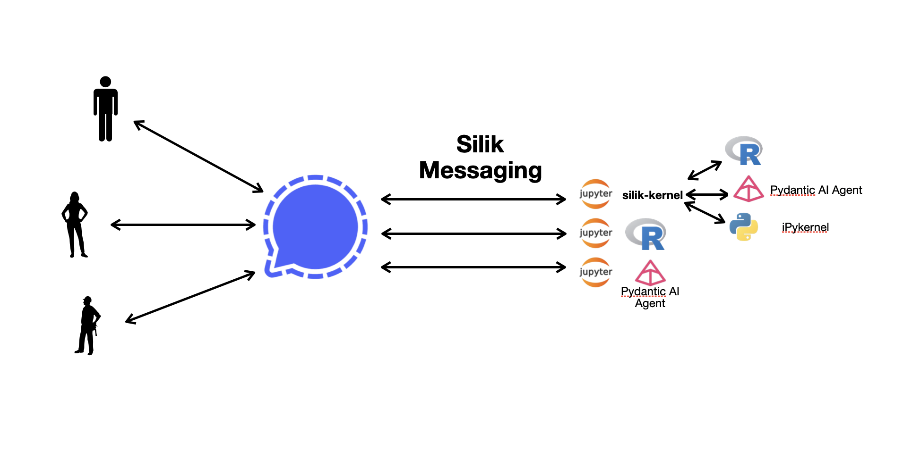

# Silik Messaging

This python application allows to interface between the Signal Messaging Application and a Jupyter kernel. It can be seen as a way of using Signal as a frontend for jupyter kernel.

> It can of course be plugged to [Silik Kernel](https://github.com/mariusgarenaux/silik-kernel) - but its up to you 🙂.



## Why Signal ?

> **Instead of rewriting an other web interface for chat, we have** :

- **encryption** protocol for free
- **group messages** and **multi-user** for free
- **no authentication** needed
- **cross-platform** implementation for free
- open source, with an easy to use contenairized **REST API**
- self-hosted deployment is easy : no need to deploy a server on internet (we use Signal ones ;-) ) + you can use signal 'notes' to send messages to yourself

## Getting started

After cloning the repo : `git clone https://github.com/mariusgarenaux/silik-messaging` :

- You need to run the [signal http REST api](https://github.com/bbernhard/signal-cli-rest-api); and initialize it with a Signal account.

- Once it is started and initialized, you have to set up the config file, and run the app.

These two steps are detailed below.

### Signal REST API

A Signal REST API, contenairized, already exists. Its setup can be done by following the steps from https://github.com/bbernhard/signal-cli-rest-api, which we have copied here for clarity :

1. Create a directory for the configuration
   This allows you to update `signal-cli-rest-api` by just deleting and recreating the container without the need to re-register your signal number

```bash
$ mkdir -p $HOME/.local/share/signal-api
```

2. Start a container

```bash
$ sudo docker run -d --name signal-api --restart=always -p 8080:8080 \
      -v $HOME/.local/share/signal-api:/home/.local/share/signal-cli \
      -e 'MODE=native' bbernhard/signal-cli-rest-api
```

3. Register or Link your Signal Number

In this case we'll register our container as secondary device, assuming that you already have your primary number running / assigned to your mobile.

Therefore open `http://localhost:8080/v1/qrcodelink?device_name=signal-api` in your browser, open Signal on your mobile phone, go to \_Settings > Linked devices\* and scan the QR code using the \*+\_ button.

4. Test your new REST API

Call the REST API endpoint and send a test message: Replace `+4412345` with your signal number in international number format, and `+44987654` with the recipients number.

```bash
$ curl -X POST -H "Content-Type: application/json" 'http://localhost:8080/v2/send' \
     -d '{"message": "Test via Signal API!", "number": "+4412345", "recipients": [ "+44987654" ]}'
```

You should now have send a message to `+44987654`.

### Set up config and start the application

The application is shipped with an example configuration file : [config_ex.yaml](config_ex.yaml). Rename it to [config.yaml](config.yaml) so that it is detected by the application. Here is the description :

```yaml
api_url: url of signal rest API, most probably : http://localhost:8080/
harvest_delay: seconds, how frequently messages from signal account are retrieved by the API .5
kernel_name: name of the kernel that will be plugged to all whitelisted conversations, run `jupyter kernelspec list` to get all available kernel names
whitelist:
  - "signal uid or phone number"
  - "signal uid or phone number"
  - "signal uid or phone number"
logging_level: DEBUG
```

To know the uuid of your contacts in the Signal, just go to : `http://localhost:8080/v1/contacts/{your_phone_number}`.
